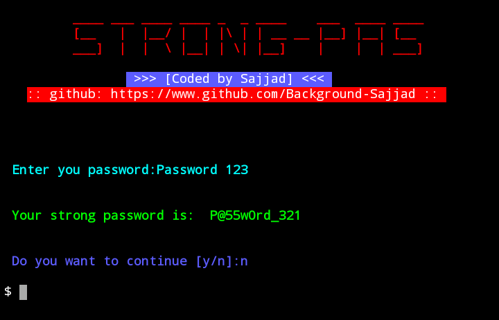

### About this tool:
  This tool make your password more strong.
  
  ### Screenshot.
  

### Installation:

     $apt-get update -y
     
     $apt-get upgrade -y
     
     $pkg install python
     
     $pkg install python3
     
     $pkg install git
     
     $git clone https://www.github.com/Background-Sajjad/Strong-Pas
     
     $cd Strong-Pas
     
     $python3 strong-pas.py
     
  Now enter the password which you want to modify.
 
 
 
### Available for
   * Termux.

### Warning
**⚠️This tool is only for educational purposes. If you use this tool any illegal way we are not responsible for it.⚠️**
